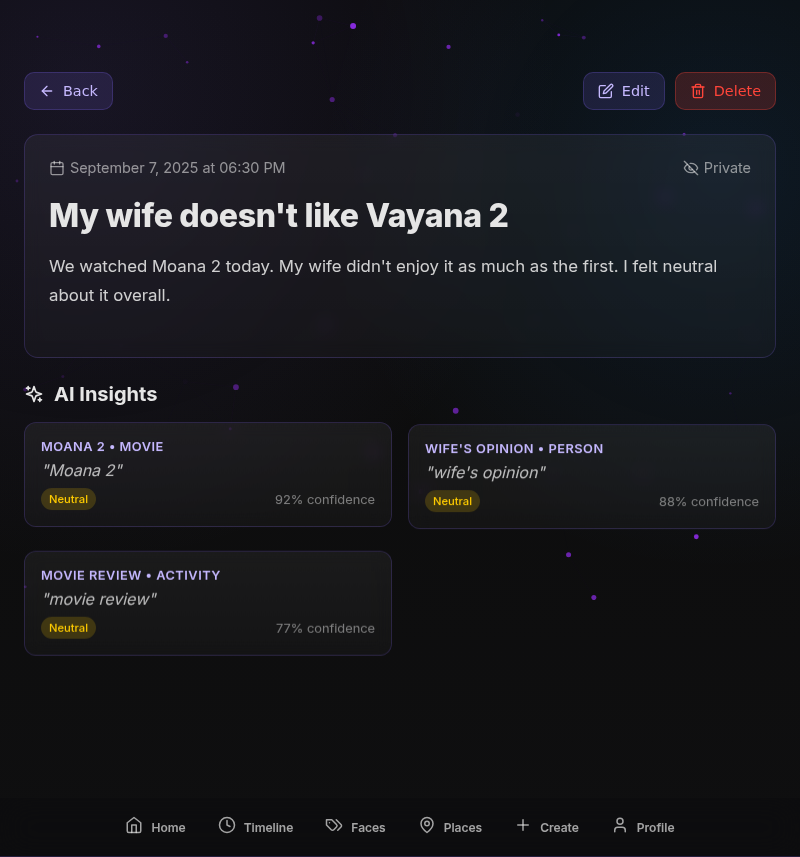
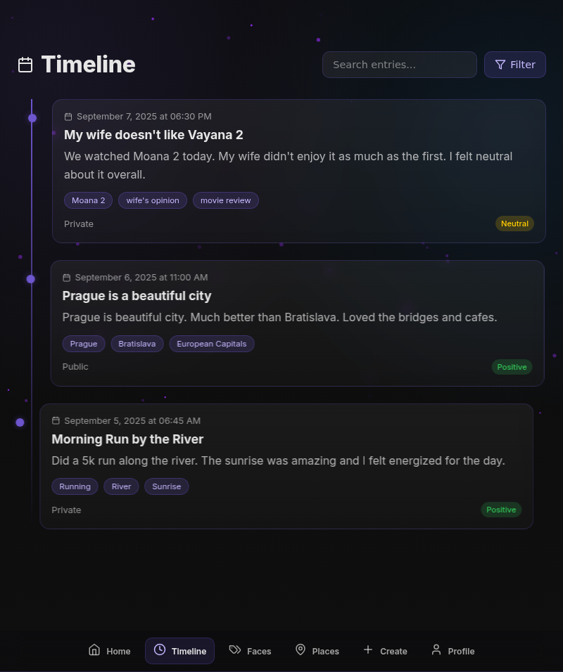
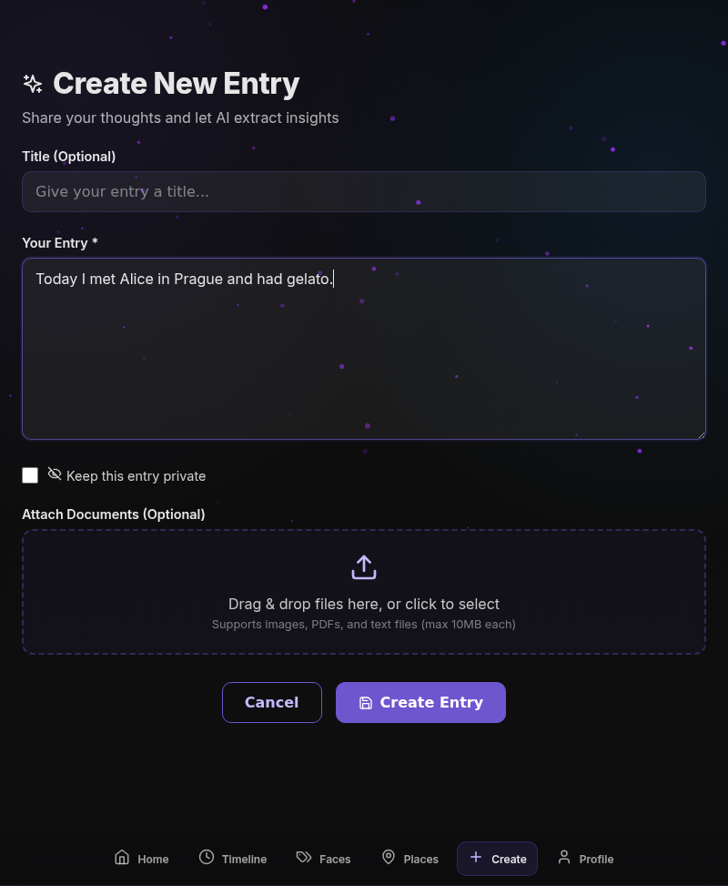

# MindJourney - AI-Powered Diary with Insights

A beautiful, modern diary application that uses AI to extract insights from your entries, categorize experiences, and analyze sentiment. Built with Django and React, featuring a stunning dark star theme with particle effects.

## Screenshots

<p align="center">
  
</p>

<p align="center">
  
</p>

<p align="center">
  
</p>

<p align="center">
  
</p>

<p align="center">
  
</p>

<p align="center">
  
</p>

<p align="center">
  
</p>

<p align="center">
  
</p>

## Features

### 🎨 Beautiful UI
- Dark star theme with animated particle background
- Neon elements and smooth animations
- Mobile-first responsive design
- Stunning timeline and map views

### 🤖 AI-Powered Insights
- Automatic extraction of places, products, movies, meals, and more
- Sentiment analysis for each insight
- Dynamic category creation
- Confidence scoring for AI predictions

### 📱 Core Functionality
- Create, edit, and delete diary entries
- Document upload support
- Public/private entry settings
- Search and filter capabilities
- Timeline view with selectable entries
- Interactive map with sentiment-based colors

### 🗺️ Map Integration
- Visual representation of places mentioned in entries
- Color-coded markers based on sentiment
- Interactive popups with insight details
- Filter by category type

## Tech Stack

### Backend
- **Django 4.2** - Web framework
- **Django REST Framework** - API development
- **PostgreSQL** - Database
- **Redis** - Caching and message broker
- **Celery** - Background task processing
- **Google Gemini** - AI insights extraction
- **Pydantic** - Data validation
- **Returns** - Functional error handling

### Frontend
- **React 18** - UI framework
- **React Router** - Client-side routing
- **Styled Components** - CSS-in-JS styling
- **Framer Motion** - Animations
- **React Query** - Data fetching and caching
- **React Leaflet** - Map integration
- **React Hook Form** - Form handling
- **React Dropzone** - File uploads

## Quick Start

### Prerequisites
- Docker and Docker Compose (recommended)
- OR Python 3.11+ and Node.js 18+ (for local development)
- Gemini API key

### Setup

1. **Clone the repository**
   ```bash
   git clone <repository-url>
   cd mindjourney
   ```

2. **Set up environment variables**
   ```bash
   cp env.example .env
   # Edit .env and add your Gemini API key
   ```

3. **Start the application (Docker - Recommended)**
   ```bash
   ./start.sh
   ```

4. **OR Install dependencies and start manually**
   ```bash
   # Install dependencies
   ./install-deps.sh
   
   # Start backend (in one terminal)
   cd backend
   python manage.py migrate
   python manage.py runserver
   
   # Start frontend (in another terminal)
   cd frontend
   npm start
   
   # Start Celery worker (in a third terminal)
   cd backend
   celery -A mindjourney worker --loglevel=info
   ```

5. **Access the application**
   - Frontend: http://localhost:3000
   - Backend API: http://localhost:8000
   - Admin Panel: http://localhost:8000/admin

### Development Setup

#### Backend Development
```bash
cd backend
python -m venv venv
source venv/bin/activate  # On Windows: venv\Scripts\activate
pip install -r requirements.txt

# Set up environment variables
export SECRET_KEY="your-secret-key"
export GEMINI_API_KEY="your-gemini-api-key"
export DB_HOST="localhost"
export DB_NAME="mindjourney"
export DB_USER="postgres"
export DB_PASSWORD="postgres"

# Run migrations
python manage.py migrate

# Create superuser
python manage.py createsuperuser

# Start development server
python manage.py runserver

# Start Celery worker (in another terminal)
celery -A mindjourney worker --loglevel=info
```

#### Frontend Development
```bash
cd frontend
npm install
npm start
```

## API Endpoints

### Entries
- `GET /api/entries/` - List user entries
- `POST /api/entries/` - Create new entry
- `GET /api/entries/{id}/` - Get entry details
- `PATCH /api/entries/{id}/` - Update entry
- `DELETE /api/entries/{id}/` - Delete entry
- `GET /api/entries/public/` - Get public entries
- `GET /api/entries/search/`